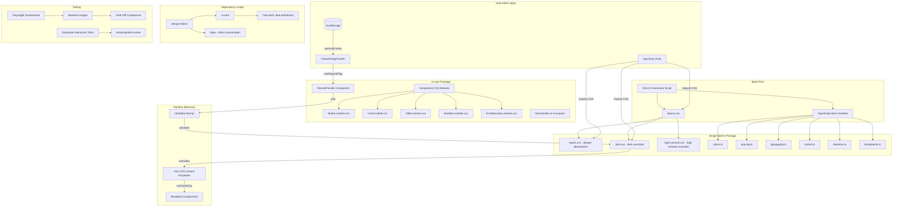
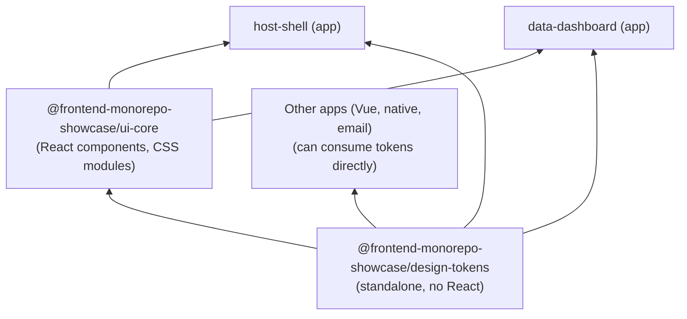
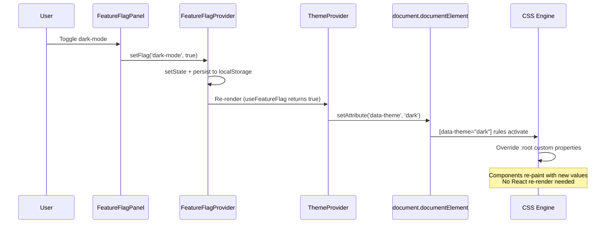

# Design Document: UI Professional Refinement

## Overview

This design transforms the `ui-core` package from inline `React.CSSProperties` styling to a CSS custom properties–based design token system with CSS module architecture. The migration enables runtime theme switching (light/dark) without React re-renders, introduces compound component patterns for Table and Card, and establishes visual regression testing with Playwright.

A key architectural decision is the **separation of design tokens into a standalone package** (`@frontend-monorepo-showcase/design-tokens`) that is independent of React and any UI framework. This enables:

- **Independent versioning** — token updates don't require ui-core releases
- **Framework-agnostic consumption** — tokens can be used by React, Vue, native, or email templates
- **Separation of design decisions from implementation** — the palette, spacing scale, and motion system are design concerns decoupled from component logic

The architecture is built on four pillars:

1. **Standalone design-tokens package** as the single source of truth for all visual values
2. **CSS Custom Properties** cascading from the design-tokens CSS into component CSS modules
3. **CSS @layer cascade management** providing deterministic specificity resolution
4. **Feature-flag–driven theme switching** via `data-theme` attribute on `<html>`

### Key Design Decisions

| Decision                                 | Rationale                                                                           |
| ---------------------------------------- | ----------------------------------------------------------------------------------- |
| Tokens in a separate package             | Framework-agnostic, independent versioning, reusable across non-React projects      |
| CSS Modules over CSS-in-JS               | Zero-runtime overhead, native browser caching, Vite built-in support                |
| `data-theme` attribute over class toggle | Works with CSS attribute selectors, single source of truth for theme state          |
| OKLCH for palette generation             | Perceptually uniform lightness steps, modern color science, progressive enhancement |
| `@layer` for cascade control             | Eliminates `!important`, deterministic priority without specificity wars            |
| Compound components via React Context    | Type-safe nesting, shared state without prop drilling                               |
| Playwright over jest-image-snapshot      | Real browser rendering, consistent cross-platform screenshots                       |

### Critical Implementation Constraints

These constraints were discovered during implementation and fundamentally shaped the architecture:

| Constraint                                                         | Impact                                                                                                                                           | Solution                                                                                                                                                                                     |
| ------------------------------------------------------------------ | ------------------------------------------------------------------------------------------------------------------------------------------------ | -------------------------------------------------------------------------------------------------------------------------------------------------------------------------------------------- |
| CSS custom properties do NOT participate in `@layer` cascade       | `@layer variants` wrapper on dark.css and high-contrast.css was ineffective — properties always cascade by specificity/order regardless of layer | Remove `@layer` wrapper from `dark.css` and `high-contrast.css`. Keep `@layer tokens` on `tokens.css` for component CSS (non-custom-property rules). Unlayered CSS always wins over layered. |
| CSS Modules don't transfer across Module Federation boundary       | Components imported from ui-core via MF remotes lose their CSS module styles in the host                                                         | Data-dashboard views use **inline styles with `var()` token references** instead of ui-core compound components. The `var()` values resolve from the host's design-tokens CSS.               |
| Module Federation bootstrap transform breaks Vite alias resolution | CSS imports in `main.tsx` fail when MF wraps it in `?mf-entry-bootstrap`                                                                         | Move design-tokens CSS imports to `__root.tsx` (the root route, not the entry point)                                                                                                         |
| Vite alias object format doesn't reliably resolve nested subpaths  | `@frontend-monorepo-showcase/design-tokens/css/dark` fails with object aliases                                                                   | Use **array format** for Vite aliases: `[{ find: '...', replacement: '...' }]` with most-specific paths first                                                                                |
| `workspace:*` is pnpm-only                                         | npm workspaces don't support the `workspace:` protocol                                                                                           | Use `"*"` for local workspace package references                                                                                                                                             |
| `respectSystemPreference` overrides explicit feature flag          | When macOS has dark appearance, ThemeProvider stays dark even when flag is OFF                                                                   | Pass `respectSystemPreference={false}` from ThemeWrapper — feature flag is sole authority                                                                                                    |
| `process.env.NODE_ENV` unreliable in Vite config evaluation        | The env var isn't set when Vite loads the config file                                                                                            | Use `defineConfig(({ mode }) => ({ ... }))` function form and check `mode !== 'production'`                                                                                                  |
| Vitest doesn't inherit Vite aliases                                | Tests fail in CI for CSS imports from design-tokens subpaths                                                                                     | Add matching `resolve.alias` array to each app's `vitest.config.ts` + `css: true`                                                                                                            |
| `http-server` via npx times out in CI                              | `npx` downloads at runtime, racing against `wait-on` timeout                                                                                     | Pre-install `http-server`, `wait-on`, `concurrently` as devDependencies                                                                                                                      |
| Nx cache causes "Unrecognized Cache Artifacts" in CI               | Stale cache from different runs is incompatible                                                                                                  | Use `NX_SKIP_NX_CACHE=true` env var in CI workflow                                                                                                                                           |
| `__dirname` not available in ESM                                   | `"type": "module"` packages can't use CommonJS globals                                                                                           | Use `dirname(fileURLToPath(import.meta.url))` pattern                                                                                                                                        |

### Module Federation Styling Strategy

**For ui-core components used within the same package (host-shell direct imports):**
CSS Modules work correctly via Vite alias resolution. Components use `.module.css` files with `@layer components` and `var()` token references.

**For views in Module Federation remotes (data-dashboard):**
CSS Modules from ui-core do NOT render when loaded via federation. Instead, use:

1. Import design-tokens CSS at the top of each view file
2. Use plain HTML elements (`<table>`, `<div>`, `<button>`) with inline `style` props
3. Reference CSS custom properties in inline styles: `style={{ color: 'var(--color-text-primary, #111827)' }}`
4. This approach guarantees styles render regardless of how the component is loaded

**CSS import location for host-shell:**

```typescript
// apps/host-shell/src/routes/__root.tsx (NOT main.tsx)
import '@frontend-monorepo-showcase/design-tokens/css/layers';
import '@frontend-monorepo-showcase/design-tokens/css';
import '@frontend-monorepo-showcase/design-tokens/css/dark';
import '@frontend-monorepo-showcase/design-tokens/css/high-contrast';
```

### Vite Alias Configuration (Required Pattern)

All apps using design-tokens must use the **array format** for aliases:

```typescript
// apps/host-shell/vite.config.ts (and data-dashboard/vite.config.ts)
export default defineConfig(({ mode }) => ({
  resolve: {
    alias:
      mode !== 'production'
        ? [
            {
              find: '@frontend-monorepo-showcase/design-tokens/css/layers',
              replacement: path.resolve(__dirname, '../../packages/design-tokens/src/layers.css'),
            },
            {
              find: '@frontend-monorepo-showcase/design-tokens/css/dark',
              replacement: path.resolve(__dirname, '../../packages/design-tokens/src/dark.css'),
            },
            {
              find: '@frontend-monorepo-showcase/design-tokens/css/high-contrast',
              replacement: path.resolve(
                __dirname,
                '../../packages/design-tokens/src/high-contrast.css',
              ),
            },
            {
              find: '@frontend-monorepo-showcase/design-tokens/css',
              replacement: path.resolve(__dirname, '../../packages/design-tokens/src/tokens.css'),
            },
            {
              find: '@frontend-monorepo-showcase/design-tokens',
              replacement: path.resolve(__dirname, '../../packages/design-tokens/src'),
            },
            {
              find: '@frontend-monorepo-showcase/ui-core',
              replacement: path.resolve(__dirname, '../../packages/ui-core/src'),
            },
          ]
        : [],
  },
  // ...
}));
```

**Order matters:** More-specific paths MUST come before less-specific ones.

## Architecture

### System Architecture Diagram



### Package Dependency Graph



### Theme Switching Data Flow



## Components and Interfaces

### 1. Token System (design-tokens Package)

The `@frontend-monorepo-showcase/design-tokens` package is a standalone, framework-agnostic package containing all design token definitions, CSS stylesheets, and TypeScript value exports. It has zero runtime dependencies.

#### Package Configuration

```json
{
  "name": "@frontend-monorepo-showcase/design-tokens",
  "version": "0.0.1",
  "type": "module",
  "sideEffects": ["**/*.css"],
  "exports": {
    ".": {
      "types": "./dist/index.d.ts",
      "import": "./dist/esm/index.js",
      "require": "./dist/cjs/index.cjs"
    },
    "./css": "./dist/tokens.css",
    "./css/layers": "./dist/layers.css",
    "./css/dark": "./dist/dark.css",
    "./css/high-contrast": "./dist/high-contrast.css",
    "./colors": {
      "types": "./dist/colors.d.ts",
      "import": "./dist/esm/colors.js",
      "require": "./dist/cjs/colors.cjs"
    },
    "./spacing": {
      "types": "./dist/spacing.d.ts",
      "import": "./dist/esm/spacing.js",
      "require": "./dist/cjs/spacing.cjs"
    },
    "./typography": {
      "types": "./dist/typography.d.ts",
      "import": "./dist/esm/typography.js",
      "require": "./dist/cjs/typography.cjs"
    },
    "./motion": {
      "types": "./dist/motion.d.ts",
      "import": "./dist/esm/motion.js",
      "require": "./dist/cjs/motion.cjs"
    },
    "./elevation": {
      "types": "./dist/elevation.d.ts",
      "import": "./dist/esm/elevation.js",
      "require": "./dist/cjs/elevation.cjs"
    },
    "./breakpoints": {
      "types": "./dist/breakpoints.d.ts",
      "import": "./dist/esm/breakpoints.js",
      "require": "./dist/cjs/breakpoints.cjs"
    }
  },
  "scripts": {
    "build": "vite build",
    "generate-tokens": "tsx scripts/generate-tokens.ts",
    "lint": "eslint .",
    "test": "vitest run"
  },
  "devDependencies": {
    "vite": "*",
    "vite-plugin-dts": "*",
    "typescript": "*",
    "tsx": "*"
  }
}
```

#### Token CSS Generation (Build-Time)

```typescript
// packages/design-tokens/scripts/generate-tokens.ts

interface OklchConfig {
  hue: number; // 0–360
  chroma: number; // 0–0.4 typical
  lightnessRange: [number, number]; // e.g., [0.97, 0.25] for shade 50→900
}

interface ColorScaleConfig {
  primary: OklchConfig;
  secondary: OklchConfig;
  success: OklchConfig;
  warning: OklchConfig;
  error: OklchConfig;
}

interface GeneratedShade {
  shade: number; // 50, 100, 200, ..., 900
  hex: string; // sRGB hex fallback
  oklch: { l: number; c: number; h: number }; // Source coordinates
}

function generateColorScale(config: OklchConfig): GeneratedShade[];
function oklchToSrgbHex(l: number, c: number, h: number): string;
function validateContrastRatio(fg: string, bg: string, minRatio: number): boolean;
```

#### Token CSS Output Structure

```css
/* packages/design-tokens/src/tokens.css */

@layer tokens {
  :root {
    /* Color scales - primary */
    --color-primary-50: #eff6ff;
    --color-primary-100: #dbeafe;
    /* ... through 900 */

    /* Semantic colors */
    --color-background: #ffffff;
    --color-surface: #f9fafb;
    --color-text-primary: #111827;
    --color-text-secondary: #4b5563;
    --color-text-disabled: #9ca3af;
    --color-text-inverse: #ffffff;

    /* Spacing */
    --spacing-xs: 4px;
    --spacing-sm: 8px;
    --spacing-md: 12px;
    --spacing-lg: 16px;
    --spacing-xl: 24px;
    --spacing-2xl: 32px;
    --spacing-3xl: 48px;
    --spacing-4xl: 64px;

    /* Typography */
    --font-family-sans: 'Inter', -apple-system, BlinkMacSystemFont, 'Segoe UI', Roboto, sans-serif;
    --font-family-mono: 'JetBrains Mono', 'Fira Code', 'Cascadia Code', monospace;
    --font-size-xs: 0.75rem;
    --font-size-sm: 0.875rem;
    --font-size-base: 1rem;
    --font-size-lg: 1.125rem;
    --font-size-xl: 1.25rem;
    --font-size-2xl: 1.5rem;
    --font-size-3xl: 1.875rem;
    --font-size-4xl: 2.25rem;
    --font-weight-normal: 400;
    --font-weight-medium: 500;
    --font-weight-semibold: 600;
    --font-weight-bold: 700;
    --font-line-height-tight: 1.25;
    --font-line-height-normal: 1.5;
    --font-line-height-relaxed: 1.75;

    /* Motion - Durations */
    --motion-duration-instant: 0ms;
    --motion-duration-fast: 100ms;
    --motion-duration-normal: 200ms;
    --motion-duration-slow: 300ms;
    --motion-duration-slower: 500ms;

    /* Motion - Easing */
    --motion-easing-ease-in: cubic-bezier(0.4, 0, 1, 1);
    --motion-easing-ease-out: cubic-bezier(0, 0, 0.2, 1);
    --motion-easing-ease-in-out: cubic-bezier(0.4, 0, 0.2, 1);
    --motion-easing-spring: cubic-bezier(0.175, 0.885, 0.32, 1.275);

    /* Elevation */
    --elevation-0: none;
    --elevation-1: 0 1px 2px rgba(0, 0, 0, 0.05);
    --elevation-2: 0 1px 3px rgba(0, 0, 0, 0.1), 0 1px 2px rgba(0, 0, 0, 0.06);
    --elevation-3: 0 4px 6px rgba(0, 0, 0, 0.1), 0 2px 4px rgba(0, 0, 0, 0.06);
    --elevation-4: 0 10px 15px rgba(0, 0, 0, 0.1), 0 4px 6px rgba(0, 0, 0, 0.05);

    /* Breakpoints */
    --breakpoint-xs: 0px;
    --breakpoint-sm: 480px;
    --breakpoint-md: 768px;
    --breakpoint-lg: 1024px;
    --breakpoint-xl: 1280px;
    --breakpoint-2xl: 1536px;
  }
}
```

#### Dark Theme Override Layer

```css
/* packages/design-tokens/src/dark.css */

/* IMPORTANT: No @layer wrapper. CSS custom properties don't cascade via layers.
   Unlayered CSS always wins over layered CSS for custom property declarations. */
[data-theme='dark'] {
  /* Color scales - primary (OKLCH-generated, darker shades lighter, lighter shades darker) */
  --color-primary-50: #172554;
  --color-primary-100: #1e3a8a;
  /* ... inverted lightness curve */
  --color-primary-900: #eff6ff;

  /* Semantic colors */
  --color-background: #0f172a;
  --color-surface: #1e293b;
  --color-text-primary: #f1f5f9;
  --color-text-secondary: #94a3b8;
  --color-text-disabled: #475569;
  --color-text-inverse: #0f172a;

  /* Elevation - dark mode uses subtle glow/borders */
  --elevation-0: none;
  --elevation-1: 0 1px 2px rgba(0, 0, 0, 0.3), 0 0 0 1px rgba(255, 255, 255, 0.05);
  --elevation-2: 0 1px 3px rgba(0, 0, 0, 0.4), 0 0 0 1px rgba(255, 255, 255, 0.07);
  --elevation-3: 0 4px 6px rgba(0, 0, 0, 0.4), 0 0 0 1px rgba(255, 255, 255, 0.07);
  --elevation-4: 0 10px 15px rgba(0, 0, 0, 0.5), 0 0 0 1px rgba(255, 255, 255, 0.1);
}
```

#### Reduced Motion Override (in tokens.css)

```css
/* packages/design-tokens/src/tokens.css (appended) */

@layer tokens {
  @media (prefers-reduced-motion: reduce) {
    :root {
      --motion-duration-instant: 0ms;
      --motion-duration-fast: 0ms;
      --motion-duration-normal: 0ms;
      --motion-duration-slow: 0ms;
      --motion-duration-slower: 0ms;
    }
  }
}
```

### 2. CSS Layer Architecture

```css
/* packages/design-tokens/src/layers.css — imported FIRST in consuming app */
@layer tokens, base, components, variants, utilities;
```

Layer responsibilities:

- **tokens**: All `--custom-property` declarations (`:root` and theme overrides) — lives in design-tokens package
- **base**: CSS reset/normalize (box-sizing, margin removal, font inheritance)
- **components**: CSS module styles for Button, Card, Table, Skeleton, ErrorBoundary — lives in ui-core package
- **variants**: Theme overrides (`[data-theme="dark"]`), responsive, states, high-contrast — lives in design-tokens package
- **utilities**: Optional utility classes for consuming applications

#### Consuming App Entry Point Pattern

```typescript
// apps/host-shell/src/routes/__root.tsx (NOT main.tsx — MF bootstrap transform breaks resolution in entry points)
import '@frontend-monorepo-showcase/design-tokens/css/layers'; // Layer order first
import '@frontend-monorepo-showcase/design-tokens/css'; // Token values (:root declarations)
import '@frontend-monorepo-showcase/design-tokens/css/dark'; // Dark theme overrides
// High-contrast overrides loaded automatically via @media query in the CSS, or:
// import '@frontend-monorepo-showcase/design-tokens/css/high-contrast';
```

### 3. ThemeProvider Component (ui-core)

The ThemeProvider is React-specific and lives in `ui-core`. It reads token values via CSS custom properties that cascade from the design-tokens CSS loaded at the app entry point.

```typescript
// packages/ui-core/src/providers/ThemeProvider.tsx

export interface ThemeProviderProps {
  children: React.ReactNode;
  /** Whether dark mode is currently active. Driven by the host app's feature flag system. */
  isDarkMode: boolean;
  /** Override system preference detection. Defaults to true. */
  respectSystemPreference?: boolean;
}

export function ThemeProvider({
  children,
  isDarkMode,
  respectSystemPreference = true,
}: ThemeProviderProps): React.ReactElement;
```

**Implementation behavior:**

1. On mount, sets `document.documentElement.dataset.theme` based on `isDarkMode` prop
2. On `isDarkMode` change, updates `data-theme` attribute synchronously in a `useLayoutEffect`
3. If `respectSystemPreference` is true and no explicit preference exists, reads `window.matchMedia('(prefers-color-scheme: dark)')`
4. Injects theme transition CSS class that enables `transition: color, background-color, border-color, fill` with `var(--motion-duration-slow)` timing
5. The `prefers-reduced-motion: reduce` override (setting all `--motion-duration-*` to `0ms`) is handled by the design-tokens CSS, not by the ThemeProvider at runtime

### 4. Component CSS Module Migration

Each component follows this pattern:

```typescript
// packages/ui-core/src/components/Button/Button.tsx
import styles from './Button.module.css';

export const Button: React.FC<ButtonProps> = ({ variant = 'primary', size = 'md', ... }) => {
  const classNames = [
    styles.button,
    styles[`variant-${variant}`],
    styles[`size-${size}`],
    disabled && styles.disabled,
  ].filter(Boolean).join(' ');

  return <button className={classNames} {...rest}>{children}</button>;
};
```

```css
/* packages/ui-core/src/components/Button/Button.module.css */
@layer components {
  .button {
    display: inline-flex;
    align-items: center;
    justify-content: center;
    font-family: var(--font-family-sans, 'Inter', -apple-system, sans-serif);
    font-weight: var(--font-weight-medium, 500);
    line-height: var(--font-line-height-normal, 1.5);
    border-radius: 6px;
    cursor: pointer;
    transition:
      background-color var(--motion-duration-fast, 100ms) var(--motion-easing-ease-out),
      box-shadow var(--motion-duration-fast, 100ms) var(--motion-easing-ease-out),
      border-color var(--motion-duration-fast, 100ms) var(--motion-easing-ease-out);
    outline: none;
  }

  .variant-primary {
    background-color: var(--color-primary-600, #2563eb);
    color: var(--color-text-inverse, #ffffff);
    border: none;
  }

  .variant-secondary {
    background-color: transparent;
    color: var(--color-primary-700, #1d4ed8);
    border: 2px solid var(--color-primary-600, #2563eb);
  }

  .variant-ghost {
    background-color: transparent;
    color: var(--color-text-primary, #111827);
    border: 2px solid transparent;
  }

  .size-sm {
    padding: var(--spacing-xs, 4px) var(--spacing-sm, 8px);
    font-size: var(--font-size-sm, 0.875rem);
  }

  .size-md {
    padding: var(--spacing-sm, 8px) var(--spacing-lg, 16px);
    font-size: var(--font-size-base, 1rem);
  }

  .size-lg {
    padding: var(--spacing-md, 12px) var(--spacing-xl, 24px);
    font-size: var(--font-size-lg, 1.125rem);
  }

  .disabled {
    opacity: 0.5;
    cursor: not-allowed;
  }

  .button:focus-visible {
    box-shadow: 0 0 0 3px var(--color-primary-300, #93c5fd);
  }
}
```

### 5. Compound Component Pattern

#### Table Compound Component

```typescript
// packages/ui-core/src/components/Table/TableContext.ts
interface TableContextValue {
  variant?: 'default' | 'striped';
}

const TableContext = createContext<TableContextValue | null>(null);

// packages/ui-core/src/components/Table/Table.tsx
export interface TableRootProps {
  children: React.ReactNode;
  ariaLabel: string;
  variant?: 'default' | 'striped';
  className?: string;
}

function TableRoot({ children, ariaLabel, variant = 'default', className }: TableRootProps) {
  // Dev-mode child validation
  if (process.env.NODE_ENV === 'development') {
    React.Children.forEach(children, (child) => {
      if (React.isValidElement(child) && !isValidTableChild(child)) {
        console.warn('[Table] Invalid child component rendered. Expected Table.Header, Table.Body, or Table.Footer.');
      }
    });
  }

  return (
    <TableContext.Provider value={{ variant }}>
      <div className={styles.wrapper} role="region" aria-label={`${ariaLabel} (scrollable)`} tabIndex={0}>
        <table className={className} role="table" aria-label={ariaLabel}>
          {children}
        </table>
      </div>
    </TableContext.Provider>
  );
}

// Sub-components
function TableHeader({ children }: { children: React.ReactNode }) { ... }
function TableBody({ children }: { children: React.ReactNode }) { ... }
function TableRow({ children }: { children: React.ReactNode }) { ... }
function TableCell({ children, header?: boolean }: { children: React.ReactNode; header?: boolean }) { ... }
function TableFooter({ children }: { children: React.ReactNode }) { ... }

// Compound export
export const Table = Object.assign(TableRoot, {
  Header: TableHeader,
  Body: TableBody,
  Row: TableRow,
  Cell: TableCell,
  Footer: TableFooter,
});

// Legacy prop-based API preserved as convenience wrapper
export function TableLegacy<T>({ columns, data, ariaLabel }: TableProps<T>) {
  return (
    <Table ariaLabel={ariaLabel}>
      <Table.Header>
        <Table.Row>
          {columns.map(col => <Table.Cell key={col.key} header>{col.header}</Table.Cell>)}
        </Table.Row>
      </Table.Header>
      <Table.Body>
        {data.map((row, i) => (
          <Table.Row key={i}>
            {columns.map(col => (
              <Table.Cell key={col.key}>
                {col.render ? col.render(row[col.key], row) : String(row[col.key] ?? '')}
              </Table.Cell>
            ))}
          </Table.Row>
        ))}
      </Table.Body>
    </Table>
  );
}
```

#### Card Compound Component

```typescript
// packages/ui-core/src/components/Card/CardContext.ts
interface CardContextValue {
  hasHeader: boolean;
  hasFooter: boolean;
}

const CardContext = createContext<CardContextValue | null>(null);

// packages/ui-core/src/components/Card/Card.tsx
function CardRoot({ children, className, 'aria-label': ariaLabel }: CardRootProps) { ... }
function CardHeader({ children }: { children: React.ReactNode }) { ... }
function CardBody({ children }: { children: React.ReactNode }) { ... }
function CardFooter({ children }: { children: React.ReactNode }) { ... }
function CardActions({ children }: { children: React.ReactNode }) { ... }

export const Card = Object.assign(CardRoot, {
  Header: CardHeader,
  Body: CardBody,
  Footer: CardFooter,
  Actions: CardActions,
});
```

#### Type-Safe Nesting Enforcement

```typescript
// packages/ui-core/src/components/Table/types.ts

// Branded types for compile-time nesting validation
declare const TABLE_HEADER_BRAND: unique symbol;
declare const TABLE_BODY_BRAND: unique symbol;
declare const TABLE_ROW_BRAND: unique symbol;

export interface TableHeaderElement extends React.ReactElement {
  [TABLE_HEADER_BRAND]: true;
}

export interface TableBodyElement extends React.ReactElement {
  [TABLE_BODY_BRAND]: true;
}

export interface TableRowElement extends React.ReactElement {
  [TABLE_ROW_BRAND]: true;
}

// Table.Header only accepts Table.Row children
export interface TableHeaderProps {
  children: TableRowElement | TableRowElement[];
}

// Table.Body only accepts Table.Row children
export interface TableBodyProps {
  children: TableRowElement | TableRowElement[];
}
```

### 6. Data Loading Coordination Pattern

```typescript
// apps/host-shell/src/hooks/useDataTable.ts

interface UseDataTableOptions<T> {
  queryKey: unknown[];
  queryFn: () => Promise<T[]>;
  placeholderData?: T[];
}

interface UseDataTableResult<T> {
  isDataReady: boolean;
  data: T[];
  isEmpty: boolean;
  isStale: boolean;
}

export function useDataTable<T>({
  queryKey,
  queryFn,
  placeholderData,
}: UseDataTableOptions<T>): UseDataTableResult<T> {
  const query = useQuery({
    queryKey,
    queryFn,
    placeholderData: placeholderData ? keepPreviousData : undefined,
  });

  const isDataReady = query.status === 'success' && query.data !== undefined;
  const isEmpty = isDataReady && query.data.length === 0;
  const isStale = query.isPlaceholderData;

  return { isDataReady, data: query.data ?? [], isEmpty, isStale };
}
```

```tsx
// Usage in a route component
function DataDashboardPage() {
  const { isDataReady, data, isEmpty } = useDataTable({
    queryKey: ['metrics'],
    queryFn: fetchMetrics,
  });

  if (!isDataReady) {
    return <Skeleton variant="rectangular" height={400} />;
  }

  if (isEmpty) {
    return <Table.EmptyState message="No metrics available" />;
  }

  return <Table columns={columns} data={data} ariaLabel="Metrics table" />;
}
```

### 7. Visual Snapshot Test Infrastructure

```typescript
// packages/ui-core/tests/visual/visual-test.config.ts

export const VIEWPORTS = {
  mobile: { width: 320, height: 568 },
  tablet: { width: 768, height: 1024 },
  desktop: { width: 1280, height: 800 },
} as const;

export const THEMES = ['light', 'dark'] as const;

export const PIXEL_DIFF_THRESHOLD = 0.001; // 0.1%

export const BASELINE_DIR = 'tests/visual/__baselines__';
export const DIFF_DIR = 'tests/visual/__diffs__';
```

```typescript
// packages/ui-core/tests/visual/button.visual.spec.ts
import { test, expect } from '@playwright/test';

const variants = ['primary', 'secondary', 'ghost'] as const;
const sizes = ['sm', 'md', 'lg'] as const;

for (const theme of THEMES) {
  for (const variant of variants) {
    for (const size of sizes) {
      test(`Button ${variant}/${size} - ${theme}`, async ({ page }) => {
        await page.goto(`/iframe.html?id=button--${variant}&args=size:${size}`);
        await page.evaluate((t) => (document.documentElement.dataset.theme = t), theme);

        const screenshot = await page.locator('[data-testid="button"]').screenshot();
        expect(screenshot).toMatchSnapshot({
          name: `button-${variant}-${size}-${theme}.png`,
          maxDiffPixelRatio: PIXEL_DIFF_THRESHOLD,
        });
      });
    }
  }
}
```

### 8. Storybook Configuration for Autodocs

```typescript
// packages/ui-core/.storybook/main.ts
import type { StorybookConfig } from '@storybook/react-vite';

const config: StorybookConfig = {
  stories: ['../src/**/*.stories.@(ts|tsx)', '../src/**/*.mdx'],
  addons: ['@storybook/addon-docs', '@storybook/addon-a11y', '@storybook/addon-interactions'],
  framework: '@storybook/react-vite',
  docs: {
    autodocs: 'tag',
  },
  core: {
    disableTelemetry: true,
  },
};

export default config;
```

### 9. High Contrast Mode Support

```css
/* packages/design-tokens/src/high-contrast.css */

/* IMPORTANT: No @layer wrapper. CSS custom properties don't cascade via layers.
   Unlayered CSS always wins over layered CSS for custom property declarations. */
@media (prefers-contrast: more) {
  :root {
    --color-text-primary: #000000;
    --color-text-secondary: #1a1a1a;
  }

  [data-theme='dark'] {
    --color-text-primary: #ffffff;
    --color-text-secondary: #e5e5e5;
  }
}
```

```css
/* Component-level high-contrast overrides live in ui-core's CSS modules */
@layer variants {
  @media (prefers-contrast: more) {
    .button {
      border-width: 2px;
    }
    .button:focus-visible {
      outline: 3px solid currentColor;
      outline-offset: 2px;
    }
    .card {
      border-width: 2px;
    }
    .table {
      border-width: 2px;
    }
  }

  @media (forced-colors: active) {
    .button {
      /* Defer to system colors */
      background-color: ButtonFace;
      color: ButtonText;
      border-color: ButtonText;
    }
    .button:focus-visible {
      outline: 3px solid Highlight;
    }
  }
}
```

### 10. Build Pipeline Modifications

#### design-tokens Package Build (builds FIRST)

```typescript
// packages/design-tokens/vite.config.ts
import { resolve } from 'path';
import { defineConfig } from 'vite';
import dts from 'vite-plugin-dts';

export default defineConfig({
  plugins: [dts({ tsconfigPath: './tsconfig.build.json' })],
  build: {
    lib: {
      entry: {
        index: resolve(__dirname, 'src/index.ts'),
        colors: resolve(__dirname, 'src/colors.ts'),
        spacing: resolve(__dirname, 'src/spacing.ts'),
        typography: resolve(__dirname, 'src/typography.ts'),
        motion: resolve(__dirname, 'src/motion.ts'),
        elevation: resolve(__dirname, 'src/elevation.ts'),
        breakpoints: resolve(__dirname, 'src/breakpoints.ts'),
      },
      formats: ['es', 'cjs'],
      fileName: (format, entryName) => {
        const dir = format === 'es' ? 'esm' : 'cjs';
        const ext = format === 'es' ? 'js' : 'cjs';
        return `${dir}/${entryName}.${ext}`;
      },
    },
    rollupOptions: {
      external: [], // No external deps — fully standalone
    },
    cssCodeSplit: false, // Emit all CSS in output
    outDir: 'dist',
    emptyOutDir: true,
  },
});
```

#### ui-core Package Build (builds AFTER design-tokens)

```typescript
// packages/ui-core/vite.config.ts (updated)
import { resolve } from 'path';
import react from '@vitejs/plugin-react';
import { defineConfig } from 'vite';
import dts from 'vite-plugin-dts';

export default defineConfig({
  plugins: [react(), dts({ tsconfigPath: './tsconfig.build.json', outDirs: './dist' })],
  css: {
    modules: {
      localsConvention: 'camelCase',
      generateScopedName: '[name]__[local]__[hash:base64:5]',
    },
  },
  build: {
    lib: {
      entry: {
        index: resolve(__dirname, 'src/index.ts'),
        Button: resolve(__dirname, 'src/components/Button/index.ts'),
        Card: resolve(__dirname, 'src/components/Card/index.ts'),
        Table: resolve(__dirname, 'src/components/Table/index.ts'),
        Skeleton: resolve(__dirname, 'src/components/Skeleton/index.ts'),
        ErrorBoundary: resolve(__dirname, 'src/components/ErrorBoundary/index.ts'),
        theme: resolve(__dirname, 'src/theme/index.ts'), // Backward-compat re-export
      },
      formats: ['es', 'cjs'],
      fileName: (format, entryName) => {
        const dir = format === 'es' ? 'esm' : 'cjs';
        const ext = format === 'es' ? 'js' : 'cjs';
        return `${dir}/${entryName}.${ext}`;
      },
    },
    rollupOptions: {
      external: [
        'react',
        'react-dom',
        'react/jsx-runtime',
        '@frontend-monorepo-showcase/design-tokens',
        /^@frontend-monorepo-showcase\/design-tokens\//,
      ],
      output: { preserveModules: false },
    },
    cssCodeSplit: true, // Emit per-component CSS
    outDir: 'dist',
    emptyOutDir: true,
  },
});
```

#### Build Order (Nx Dependency Graph)

The Nx workspace automatically resolves the build order via the `dependsOn` relationships in `package.json`:

```text
design-tokens:build  →  ui-core:build  →  host-shell:build / data-dashboard:build
```

Because `ui-core`'s `package.json` declares `@frontend-monorepo-showcase/design-tokens` as a dependency, Nx infers the correct topological build order. No additional `nx.json` configuration is needed for build ordering.

#### Updated ui-core package.json (dependency on design-tokens)

```json
{
  "name": "@frontend-monorepo-showcase/ui-core",
  "dependencies": {
    "@frontend-monorepo-showcase/design-tokens": "*"
  },
  "peerDependencies": {
    "react": ">=18.0.0",
    "react-dom": ">=18.0.0"
  }
}
```

Note: `ui-core` components use `var()` references to CSS custom properties. They do NOT import CSS from design-tokens at runtime — the app is responsible for importing the design-tokens CSS at the entry point. The `theme/index.ts` in ui-core re-exports TypeScript token values from design-tokens for backward compatibility.

## Data Models

### Token Data Structures

```typescript
// packages/design-tokens/src/types.ts

/** OKLCH color metadata for each shade */
export interface OklchMeta {
  l: number; // Lightness 0–1
  c: number; // Chroma 0–0.4
  h: number; // Hue 0–360
}

/** A single color shade with hex value and OKLCH source */
export interface ColorShade {
  hex: string;
  oklch: OklchMeta;
}

/** A complete color scale (50–900) */
export type ColorScale = Record<
  50 | 100 | 200 | 300 | 400 | 500 | 600 | 700 | 800 | 900,
  ColorShade
>;

/** Full color token set */
export interface ColorTokens {
  primary: ColorScale;
  secondary: ColorScale;
  success: ColorScale;
  warning: ColorScale;
  error: ColorScale;
  neutral: ColorScale;
  background: string;
  surface: string;
  text: {
    primary: string;
    secondary: string;
    disabled: string;
    inverse: string;
  };
}

/** Motion duration tokens */
export interface MotionDurations {
  instant: string; // '0ms'
  fast: string; // '100ms'
  normal: string; // '200ms'
  slow: string; // '300ms'
  slower: string; // '500ms'
}

/** Motion easing tokens */
export interface MotionEasings {
  'ease-in': string;
  'ease-out': string;
  'ease-in-out': string;
  spring: string;
}

/** Elevation tokens */
export interface ElevationTokens {
  'level-0': string;
  'level-1': string;
  'level-2': string;
  'level-3': string;
  'level-4': string;
}

/** Breakpoint tokens (numeric px values) */
export interface BreakpointTokens {
  xs: number; // 0
  sm: number; // 480
  md: number; // 768
  lg: number; // 1024
  xl: number; // 1280
  '2xl': number; // 1536
}
```

### Theme Configuration

```typescript
// packages/design-tokens/src/config.ts

/** OKLCH generation config per color scale */
export const colorScaleConfigs: Record<string, OklchConfig> = {
  primary: { hue: 225, chroma: 0.18, lightnessRange: [0.97, 0.3] },
  secondary: { hue: 270, chroma: 0.17, lightnessRange: [0.97, 0.28] },
  success: { hue: 145, chroma: 0.16, lightnessRange: [0.97, 0.3] },
  warning: { hue: 45, chroma: 0.18, lightnessRange: [0.97, 0.35] },
  error: { hue: 25, chroma: 0.19, lightnessRange: [0.97, 0.3] },
  neutral: { hue: 0, chroma: 0.0, lightnessRange: [0.98, 0.15] },
};
```

### File Structure

```text
packages/design-tokens/
├── package.json              # @frontend-monorepo-showcase/design-tokens
├── vite.config.ts            # Vite library mode build config
├── tsconfig.json
├── tsconfig.build.json
├── src/
│   ├── index.ts              # Barrel export of all TypeScript token objects
│   ├── types.ts              # Token type definitions
│   ├── config.ts             # OKLCH generation config
│   ├── colors.ts             # Generated color values with OKLCH metadata
│   ├── spacing.ts            # Spacing scale values
│   ├── typography.ts         # Typography values
│   ├── motion.ts             # Motion duration & easing constants
│   ├── elevation.ts          # Elevation shadow values
│   ├── breakpoints.ts        # Breakpoint numeric values
│   ├── layers.css            # @layer declaration order
│   ├── tokens.css            # :root CSS custom property declarations
│   ├── dark.css              # [data-theme="dark"] overrides
│   └── high-contrast.css     # @media (prefers-contrast: more) overrides
├── scripts/
│   └── generate-tokens.ts    # OKLCH palette generation script
└── __tests__/
    ├── tokens.property.test.ts     # Properties 1, 2, 7, 8, 9
    └── contrast.property.test.ts   # Property 3

packages/ui-core/
├── package.json              # @frontend-monorepo-showcase/ui-core (depends on design-tokens)
├── vite.config.ts
├── tsconfig.json
├── tsconfig.build.json
├── src/
│   ├── providers/
│   │   ├── ThemeProvider.tsx      # Theme attribute management (React-specific)
│   │   └── ThemeProvider.module.css
│   ├── components/
│   │   ├── Button/
│   │   │   ├── index.ts          # Barrel export
│   │   │   ├── Button.tsx        # Component implementation
│   │   │   ├── Button.module.css # Scoped styles referencing token vars
│   │   │   ├── Button.stories.tsx
│   │   │   └── Button.test.tsx
│   │   ├── Card/
│   │   │   ├── index.ts
│   │   │   ├── Card.tsx
│   │   │   ├── CardContext.ts
│   │   │   ├── Card.module.css
│   │   │   ├── Card.stories.tsx
│   │   │   └── Card.test.tsx
│   │   ├── Table/
│   │   │   ├── index.ts
│   │   │   ├── Table.tsx          # Compound component
│   │   │   ├── TableLegacy.tsx    # Prop-based backward compat wrapper
│   │   │   ├── TableContext.ts
│   │   │   ├── Table.module.css
│   │   │   ├── Table.stories.tsx
│   │   │   └── Table.test.tsx
│   │   ├── Skeleton/
│   │   │   ├── index.ts
│   │   │   ├── Skeleton.tsx
│   │   │   ├── Skeleton.module.css
│   │   │   ├── Skeleton.stories.tsx
│   │   │   └── Skeleton.test.tsx
│   │   └── ErrorBoundary/
│   │       ├── index.ts
│   │       ├── ErrorBoundary.tsx
│   │       ├── ErrorBoundary.module.css
│   │       ├── ErrorBoundary.stories.tsx
│   │       └── ErrorBoundary.test.tsx
│   ├── theme/
│   │   └── index.ts              # Backward-compatible re-export from design-tokens
│   └── index.ts                  # Main barrel export
├── tests/
│   └── visual/
│       ├── visual-test.config.ts
│       ├── button.visual.spec.ts
│       ├── card.visual.spec.ts
│       ├── table.visual.spec.ts
│       ├── skeleton.visual.spec.ts
│       ├── errorboundary.visual.spec.ts
│       └── __baselines__/        # Stored baseline screenshots
└── __tests__/
    ├── css-modules.property.test.ts     # Properties 4, 5
    └── theme-transition.property.test.ts # Property 6
```

## Correctness Properties

_A property is a characteristic or behavior that should hold true across all valid executions of a system — essentially, a formal statement about what the system should do. Properties serve as the bridge between human-readable specifications and machine-verifiable correctness guarantees._

### Property 1: Token Naming Convention Compliance

_For any_ token path derived from the TypeScript token objects (e.g., `colors.primary.600`, `spacing.lg`, `typography.fontSizes.base`), the generated CSS custom property name SHALL follow the naming convention `--{category}-{path-segments}` with hyphen-separated segments matching the documented pattern.

**Validates: Requirements 1.3**

### Property 2: Dark Palette Structural Equivalence

_For any_ key path that exists in the light color palette object, the dark color palette object SHALL contain a value at the same key path — and vice versa — ensuring both palettes have identical structure (same keys at every nesting level).

**Validates: Requirements 2.1, 2.3**

### Property 3: Dark Palette Text-Surface Contrast Ratio

_For any_ pairing of a text color token (`text.primary`, `text.secondary`, `text.disabled`) with a surface token (`background`, `surface`) in the dark palette, the computed WCAG contrast ratio between the text color and the surface color SHALL be ≥ 4.5:1.

**Validates: Requirements 2.2, 6.1, 6.2, 6.4, 6.5**

### Property 4: CSS Variable Fallback Completeness

_For any_ `var()` function call in a component CSS module file, the call SHALL include a fallback value as the second argument (e.g., `var(--token-name, <fallback>)`) that produces the same visual output as the current hardcoded theme values.

**Validates: Requirements 4.8, 5.5, 1.6**

### Property 5: CSS Modules Reference Only Token Custom Properties

_For any_ CSS declaration in a component CSS module file that specifies a color, spacing, typography, motion, or elevation value, the value SHALL be expressed as a `var(--token-name)` reference — not as a hardcoded literal — with the exception of CSS-inherent values (`0`, `none`, `transparent`, `inherit`, `currentColor`, unitless numeric values).

**Validates: Requirements 5.2, 4.1, 4.2, 4.3, 4.4, 4.5, 11.5**

### Property 6: Theme Transition Targets Only Color Properties

_For any_ CSS `transition` declaration applied by the ThemeProvider's theme-transition class, the transitioned properties SHALL be limited to `color`, `background-color`, `border-color`, `fill`, and `box-shadow` — no layout, spacing, dimension, or transform properties SHALL appear in the transition list.

**Validates: Requirements 9.4**

### Property 7: OKLCH Lightness Uniformity

_For any_ color scale generated by the OKLCH generation function, the difference in lightness (L) between consecutive shades (50→100, 100→200, ..., 800→900) SHALL be approximately equal (within ±0.02 tolerance), producing a perceptually uniform gradient.

**Validates: Requirements 17.1, 17.3**

### Property 8: Generated Palette WCAG AA Contrast

_For any_ color scale generated by the OKLCH function, the contrast ratio between shade 700 (used for text) and shade 50 (used for backgrounds) SHALL be ≥ 4.5:1, and the contrast ratio between shade 800 and shade 100 SHALL be ≥ 4.5:1.

**Validates: Requirements 17.4**

### Property 9: Token Objects Include OKLCH Metadata

_For any_ shade in the TypeScript color token objects (primary, secondary, success, warning, error), the shade entry SHALL contain both a `hex` string value matching `/^#[0-9a-f]{6}$/i` and an `oklch` object with numeric `l`, `c`, and `h` properties where `0 ≤ l ≤ 1`, `0 ≤ c ≤ 0.4`, and `0 ≤ h ≤ 360`.

**Validates: Requirements 17.6**

## Error Handling

### Theme Provider Errors

| Scenario                                              | Handling                                                                            |
| ----------------------------------------------------- | ----------------------------------------------------------------------------------- |
| `useFeatureFlag` called outside `FeatureFlagProvider` | ThemeProvider catches error, defaults to light theme, logs warning                  |
| Invalid `data-theme` value set externally             | ThemeProvider ignores the change, retains current theme (Req 9.5)                   |
| `prefers-color-scheme` not supported                  | Falls back to light theme (default)                                                 |
| CSS custom property not defined in cascade            | Each `var()` includes fallback value producing same visual as current inline styles |
| OKLCH-to-sRGB gamut mapping failure                   | Clamp to nearest in-gamut sRGB value during build-time generation                   |

### Component Error Boundaries

| Scenario                                       | Handling                                                                                           |
| ---------------------------------------------- | -------------------------------------------------------------------------------------------------- |
| Compound component used outside parent context | `useContext` returns null → sub-component throws descriptive error in dev, renders nothing in prod |
| Invalid children passed to compound parent     | Console warning in development mode only (Req 15.4)                                                |
| CSS module import fails (missing .module.css)  | Build fails immediately — caught at compile time, not runtime                                      |

### Visual Snapshot Test Errors

| Scenario                                                | Handling                                                                                                  |
| ------------------------------------------------------- | --------------------------------------------------------------------------------------------------------- |
| No baseline exists for a component/theme/viewport combo | Test auto-generates baseline, passes (Req 7.7)                                                            |
| Pixel diff exceeds threshold                            | Test fails, outputs diff image highlighting changed regions (Req 7.9)                                     |
| Playwright browser launch failure                       | Test reports infrastructure error, does not produce false pass                                            |
| Animation non-determinism in Skeleton                   | Animations paused via `prefers-reduced-motion` or `animation-play-state: paused` before capture (Req 8.5) |

### Data Loading Coordination Errors

| Scenario                           | Handling                                                                             |
| ---------------------------------- | ------------------------------------------------------------------------------------ |
| TanStack Query fetch fails         | Error state propagated, Skeleton replaced with error message (not empty table)       |
| Query returns `undefined` data     | `isDataReady` guard prevents rendering: `status === 'success' && data !== undefined` |
| Route transition aborted mid-fetch | Previous content remains visible, no flash (Req 10.3)                                |
| Network timeout > 200ms            | Non-blocking loading indicator shown over existing content (Req 10.4)                |

## Testing Strategy

### Testing Layers

| Layer                | Tool                                      | Scope                                                                   |
| -------------------- | ----------------------------------------- | ----------------------------------------------------------------------- |
| Unit tests           | Vitest + Testing Library                  | Component logic, token generation, data models                          |
| Property-based tests | fast-check (via Vitest)                   | Token naming, contrast ratios, OKLCH uniformity, structural equivalence |
| Visual regression    | Playwright screenshots                    | All components × themes × viewports × variants                          |
| Interaction tests    | Storybook play() + @storybook/test-runner | Hover, focus, keyboard navigation, disabled states                      |
| Integration tests    | Vitest + jsdom                            | ThemeProvider ↔ feature flags, data loading coordination                |
| Pipeline validation  | Nx affected                               | ESLint, TypeScript, Vitest, Storybook build, workspace build            |

### Property-Based Testing Configuration

**Library:** `fast-check` (already in devDependencies)

**Minimum iterations:** 100 per property test

**Tag format:** Each property test includes a comment:

```typescript
// Feature: ui-professional-refinement, Property {N}: {property_text}
```

**Property test locations:**

- `packages/design-tokens/src/__tests__/tokens.property.test.ts` — Properties 1, 2, 7, 8, 9
- `packages/design-tokens/src/__tests__/contrast.property.test.ts` — Property 3
- `packages/ui-core/src/__tests__/css-modules.property.test.ts` — Properties 4, 5
- `packages/ui-core/src/__tests__/theme-transition.property.test.ts` — Property 6

### Example Property Test (Property 7: OKLCH Lightness Uniformity)

```typescript
import fc from 'fast-check';
import { describe, it, expect } from 'vitest';
import {
  generateColorScale,
  type OklchConfig,
} from '@frontend-monorepo-showcase/design-tokens/colors';

// Feature: ui-professional-refinement, Property 7: OKLCH Lightness Uniformity
describe('Property 7: OKLCH Lightness Uniformity', () => {
  const validOklchConfig = fc.record({
    hue: fc.float({ min: 0, max: 360, noNaN: true }),
    chroma: fc.float({ min: 0, max: 0.35, noNaN: true }),
    lightnessRange: fc.tuple(
      fc.float({ min: 0.85, max: 0.99, noNaN: true }), // light end
      fc.float({ min: 0.15, max: 0.4, noNaN: true }), // dark end
    ),
  }) as fc.Arbitrary<OklchConfig>;

  it('generates uniform lightness steps within ±0.02 tolerance', () => {
    fc.assert(
      fc.property(validOklchConfig, (config) => {
        const scale = generateColorScale(config);
        const lightnesses = scale.map((s) => s.oklch.l);

        const steps: number[] = [];
        for (let i = 1; i < lightnesses.length; i++) {
          steps.push(Math.abs(lightnesses[i] - lightnesses[i - 1]));
        }

        const avgStep = steps.reduce((a, b) => a + b, 0) / steps.length;
        return steps.every((step) => Math.abs(step - avgStep) <= 0.02);
      }),
      { numRuns: 100 },
    );
  });
});
```

### Unit Testing Focus Areas

- **ThemeProvider:** Verify `data-theme` attribute set correctly for true/false/undefined states; verify `prefers-reduced-motion` override; verify invalid theme value handling
- **Compound components:** Verify context isolation; verify dev-mode warnings; verify legacy prop API backward compatibility
- **Data loading coordination:** Verify `isDataReady` guard logic; verify Skeleton → Table transition timing
- **Token exports:** Verify backward compatibility of JS token objects; verify CSS file contains all expected properties

### Visual Snapshot Test Matrix

| Component     | Variants             | Themes | Viewports   | States                | Total Screenshots |
| ------------- | -------------------- | ------ | ----------- | --------------------- | ----------------- |
| Button        | 3×3 (variant×size)   | 2      | 3           | enabled + disabled(3) | 18 + 6 = 24×      |
| Card          | 2 configs            | 2      | 3           | default               | 4×                |
| Table         | populated + empty    | 2      | 3           | default               | 4×                |
| Skeleton      | 1 (animation paused) | 2      | 3           | loading               | 2×                |
| ErrorBoundary | recovery + escalated | 2      | 3           | error                 | 4×                |
| High contrast | all components       | 2      | 1 (desktop) | high-contrast         | ~10×              |

Note: Viewport coverage uses breakpoint token values (320px < sm, 768px = md, 1280px = xl).

### Storybook Interaction Tests

| Component | Interactions Tested                                                                                     |
| --------- | ------------------------------------------------------------------------------------------------------- |
| Button    | Hover style change, focus ring on Tab, Enter activation, Space activation, disabled prevents activation |
| Table     | Row hover highlight, header click sort, keyboard Enter sort, Tab focus navigation between headers       |

Each interaction test runs in both light and dark themes to verify focus rings and hover states remain visible against both backgrounds.

### Continuous Validation

Every implementation task must leave the pipeline green:

1. `nx affected -t lint` — zero ESLint errors
2. `nx affected -t typecheck` — zero TypeScript errors
3. `nx affected -t test` — all Vitest tests pass
4. `nx run @frontend-monorepo-showcase/ui-core:build-storybook` — clean exit
5. `nx affected -t build` — all workspace builds succeed (design-tokens builds before ui-core)

Single command: `nx run-many -t lint,typecheck,test,build`

Target execution time: < 5 minutes per affected workspace.
